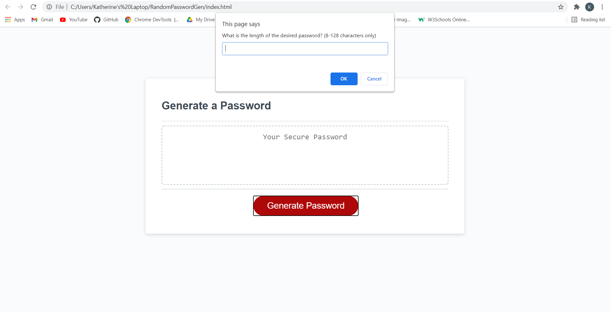
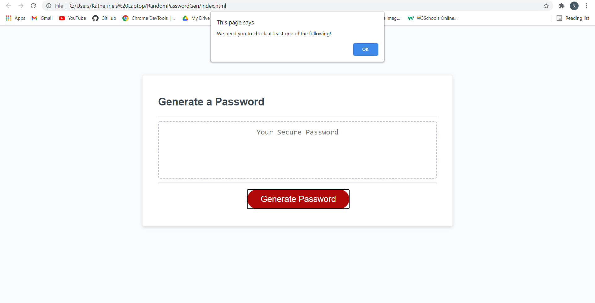
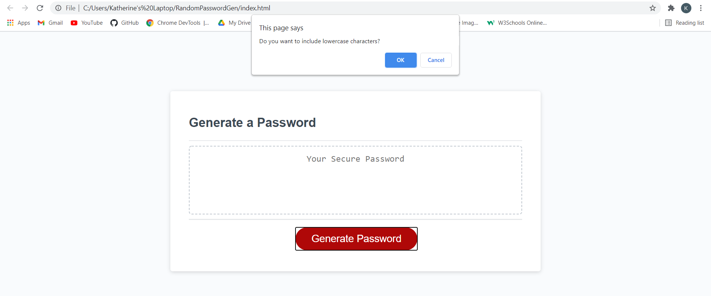
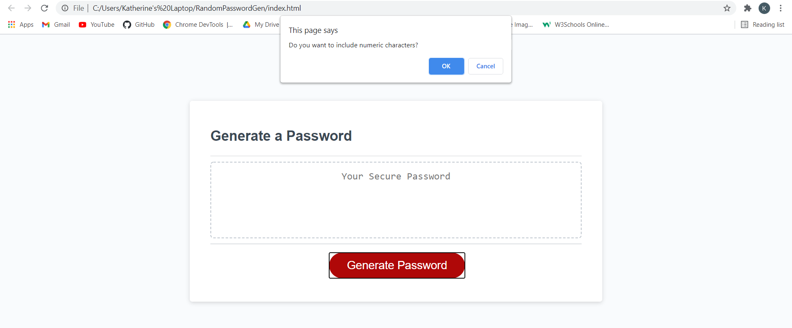
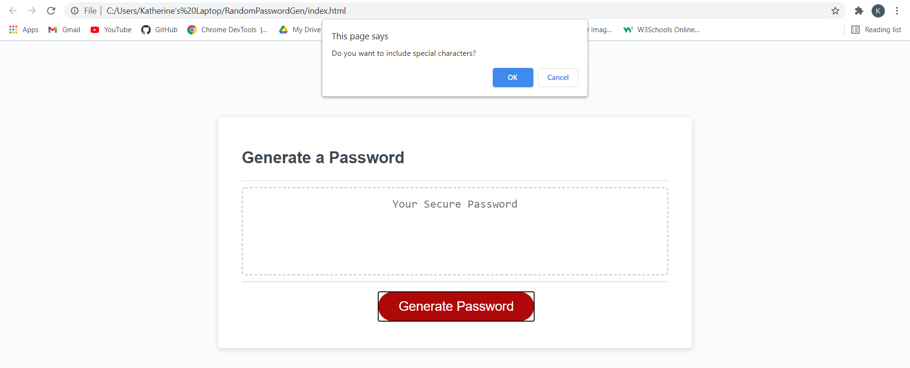

# RandomPasswordGen

## **Project Summary** ⚡️

_As a developer, I was asked by employer to create a password generator that randomly generates a password that meet certain criteria that allows to create a strong password that provides greater security._

__________________________________________________________________________________________________________________________________________________

## **Tools Used** 🛠️

* HTML
* CSS
* Javascript

___________________________________________________________________________________________________________________________________________________

## **Project Goals** 📚

* Employee is presented with a series of prompts for password criteria.
* Employee is prompted to choose between 8-128 characters for password length. If input is not vaild, they will be asked again to choose bewteen 8-128 characters.
* Employee will then be prompted to have at least on of the following criterias. such as if they will like uppercase, lowercase, numeric, or special characters.
* When all prompts are answered then a password is generated that matches the selected criteria wriiten on the page.

___________________________________________________________________________________________________________________________________________________

## **Website** 📷

*Screenshots of prompts.*

___________________________________________________________________________________________________________________________________________________

## **Recourses** 💡
[ Javascrpit: W3sschools](https://www.w3schools.com/)

[My Github: Live website](https://katherineyoguez.github.io/RandomPasswordGen/)

___________________________________________________________________________________________________________________________________________________

### _Contact_ 📇

Email: Katherinecarlotayoguez@gmail.com